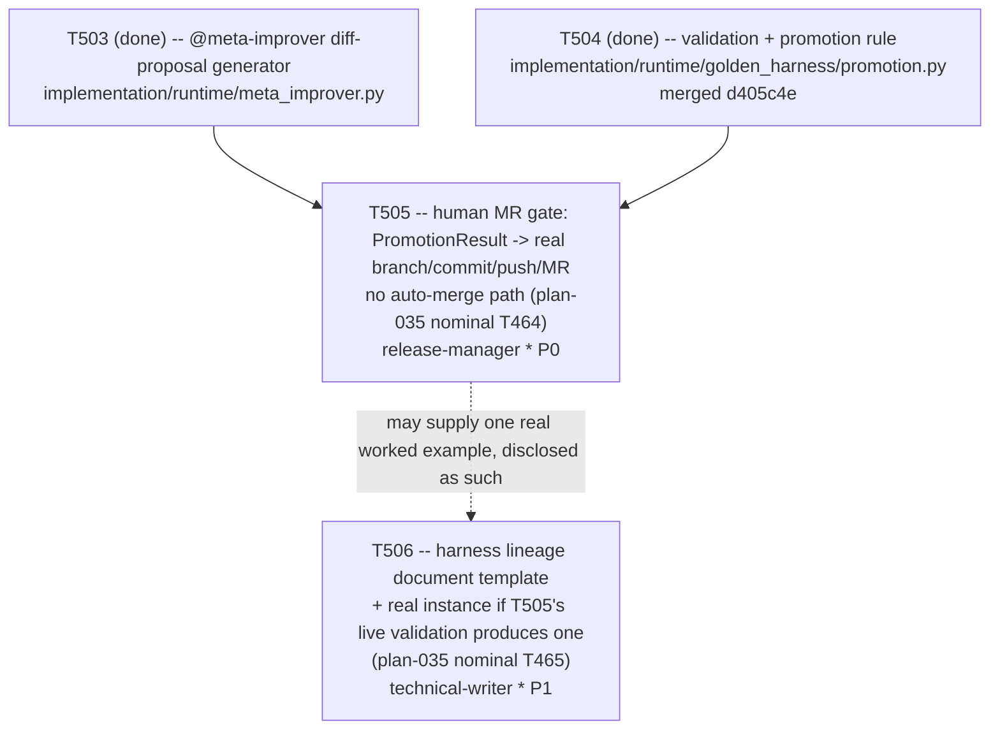

# Plan 059 — T505/T506 dispatch: plan coverage for Phase 6's final two tasks

> Filename: `plan-059-t505-t506-dispatch-plan-coverage.md`

**Status:** proposed — recorded as backlog, **not** approval for any work beyond what T505/T506
already are. This document exists only to satisfy this repo's own "no task without a backing
plan" precondition (`implementation/knowledge/commands/plan.md`'s "Task Creation Precondition",
enforced by `tests/performance/test_team_health.py::TestPlanCoverage::
test_every_active_task_has_a_plan`, which requires each active task's real ledger ID to appear as
a literal token somewhere under `docs/plans/`) for the two tasks it references (T505, T506) —
deliberately minimal, matching `plan-056`'s (T501/T502), `plan-057`'s (T503), and `plan-058`'s
(T504) precedent for this exact situation: the real detailed-planning pass already exists
(`plan-055`, referring to these two tasks by `plan-035`'s nominal `T464`/`T465` names, not by
their real ledger IDs, which `plan-055` §1 explicitly left for the orchestrator to assign at
dispatch time), this document just makes the ID mapping literal and traceable.

**Based on:** `docs/plans/plan-055-phase6-closed-loop-rescoped-detailed-planning.md` (the real
detailed-planning pass this dispatch executes the final two rows of — §4's `T464-equiv` and
`T465-equiv` rows, §1's explicit deferral of real ID assignment to dispatch time, §4's own
sequencing note: "T464-equiv depends on T463-equiv's promotion rule existing... T465-equiv can be
authored in parallel with T464-equiv"); `docs/artifacts/phase6-sia-readiness-audit-v1.md` (the
audit `plan-055` is itself based on); `docs/plans/plan-035-roadmap-v7-ground-up.md` §2.4 Phase 6
(the original T464/T465 row wording — the human-MR-gate and lineage-document acceptance criteria
quoted verbatim in each task brief below); `docs/tasks/task-T504.md` and
`implementation/runtime/golden_harness/promotion.py` (T504, done, merged `d405c4e` — this dispatch's
own real, satisfied dependency: `T504`'s `PromotionResult`/`evaluate_promotion` is the concrete
input `T505` consumes); `implementation/runtime/meta_improver.py` (T503, done, merged — the
`DiffProposal` shape both new tasks reference); `docs/tasks/task-T505.md` and
`docs/tasks/task-T506.md` (the briefs this document backs).

## Goal

Record, with a genuine backing plan reference containing their real literal IDs, the mapping from
`plan-055` §4's nominal `T464-equiv`/`T465-equiv` rows to this ledger's real `T505`/`T506` task
IDs, and confirm both are dispatched exactly as `plan-055` §4 scoped them — no scope invented here
beyond what that document already specified. Completing both closes out Phase 6's original
six-task table (`T461-equiv` through `T466-equiv`, all now real ledger IDs `T501`–`T506`).

## Task graph



`T505` depends on `T504`'s real, merged `PromotionResult`/`evaluate_promotion` output (a
`promotion_result.promote is True` value is this task's required, explicit input — it must refuse
to proceed on anything else). `T506` has no hard dependency on `T505` and can run in parallel per
`plan-055` §4's own sequencing note ("documents the *mechanism*, not a specific accepted change,
until the first real cycle completes") — but if `T505`'s own live validation exercise (performed
directly by the orchestrator, not delegated, per this dispatch's own instruction) produces a real,
disclosable MR by the time `T506` needs a worked example, `T506` may use it as one; otherwise a
clearly-labeled illustrative/template-only example is used instead, per this dispatch's explicit
instruction not to present a real accepted change that hasn't actually happened.

## Agent assignment

| Task | Real ID | `plan-035` nominal ID | Agent | Scope |
|------|---------|------------------------|-------|-------|
| Human gate: proposals open an MR against `develop`; no auto-merge path | T505 | T464 | `release-manager` (`[read, search, edit, execute, web, mcp__gitlab]` — re-confirmed fresh this dispatch) | Takes a `PromotionResult` with `promote=True` as explicit input; produces a real branch, commit, push, and MR against `develop`, then stops. Architectural (AST-scanned + adversarially tested), not merely documented, proof that no call anywhere in this task's own source can merge, approve, or auto-accept an MR. No live-dispatch split needed — opening a real MR is within `release-manager`'s own tool grant. |
| Harness lineage: `docs/harness-lineage/harness-v<N>.md` per accepted change | T506 | T465 | `technical-writer` (`[read, search, edit, web]` — re-confirmed fresh this dispatch; **no `execute`/Bash tool**, a known, disclosed, twice-recurred friction per `task-T379.md`/`task-T380.md`, budgeted for, not a structural blocker) | Template + (if a real, disclosable accepted change exists) one real instance recording what changed, which failure(s) motivated it, and a before/after scorecard, per `plan-035`'s literal wording. |

## Artifact flow

```
implementation/runtime/meta_improver.py (T503, existing, real -- DiffProposal)          ──┐
implementation/runtime/golden_harness/promotion.py (T504, existing, real -- PromotionResult) ─┼──> T505
                                                                                            ──┘
                                                                                      (build: release-manager)
                                                                                      (live validation: orchestrator,
                                                                                       executed directly, MR left open)
                                                                                            │
                                                                                            ▼
                                                                docs/artifacts/mr-gate-v1.md (new, design doc)
                                                                implementation/runtime/golden_harness/mr_gate.py (new)
                                                                A real, open, unmerged MR against develop (validation exercise)
                                                                            │
                                                                            ▼ (optional, disclosed worked example)
                                                                    T506 -- docs/harness-lineage/_template.md (new)
                                                                    docs/harness-lineage/harness-v1.md (new, if disclosable)
```

## Risks (inherited from `plan-055` §6, re-confirmed applicable here)

| Risk | Likelihood | Impact | Mitigation |
|---|---|---|---|
| T505's "no auto-merge path" property is asserted rather than proven, mirroring the exact discipline `T503`'s "never writes" guarantee and `T504`'s promotion-rule fail-closed defaults already established. | Low if the same AST-scan + adversarial-test discipline is applied; Medium if skipped. | Critical (this is the first task capable of altering the real repository if it goes wrong). | Mirror `T503`'s two-independent-proofs pattern exactly: a static AST scan of `mr_gate.py`'s own source proving zero merge/approve/auto-accept call shapes, with synthetic per-shape violation tests proving the scanner is a real detector, plus a behavioral test. The orchestrator independently re-verifies this guarantee before performing its own live validation exercise, and leaves the resulting MR open for the user's own independent review rather than merging it. |
| T506 presents an illustrative example as if it were a real accepted change. | Low (explicitly flagged in this dispatch). | Medium (misleading provenance). | T506's brief requires any non-real example to be labeled illustrative/template-only, explicitly, not silently presented as real. |
