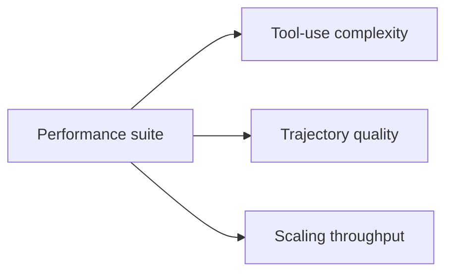
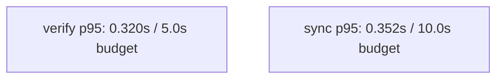

# emage.code Wiki

Welcome to the **emage.code** wiki — the central knowledge hub for the multi-platform AI dev-team orchestration framework.

Latest release: v6.0.9

## What is emage.code?

emage.code projects a single canonical knowledge base into the major AI coding assistants (GitHub Copilot, Gemini CLI, Opencode, Cursor, Pi) so that every assistant runs the *same* dev team with the *same* protocols.

## Wiki contents

| Page | Topic |
|------|-------|
| [Quick Start](quick-start) | Drop emage.code into a new project in 5 minutes |
| [Architecture](architecture) | The 6-layer architecture, knowledge → platform projection |
| [Agents Overview](agents-overview) | The 27 specialist agents and their permissions |
| [MCP Servers](mcp-servers) | Tool integrations: GitLab, Playwright, Memory, Brave, … |
| [Performance Benchmarks](performance-benchmarks) | Benchmark dimensions, thresholds, and runtime diagrams |
| [Contributing Workflow](contributing-workflow) | GitFlow + Conventional Commits + sync engine |
| [Implementation Guide](implementation-guide) | Schema-first workflows, cookbooks, triggers, packaging |

Release note: documentation updates are a required release gate. Before tagging,
update release markers and run `python3 scripts/verify-release-docs.py --tag vX.Y.Z`.
The release gate also checks the implementation documentation surface so the
wiki and repo stay aligned.

## Performance snapshot

## Project links

- **Repository:** [`em-age/emage.code`](https://gitlab.com/em-age/emage.code)
- **Issues:** [GitLab issues](https://gitlab.com/em-age/emage.code/-/issues)
- **Pipelines:** [CI/CD](https://gitlab.com/em-age/emage.code/-/pipelines)
- **License:** [MIT](https://gitlab.com/em-age/emage.code/-/blob/main/LICENSE)

## Status

New work goes to [`implementation/`](https://gitlab.com/em-age/emage.code/-/tree/main/implementation).
See the [Implementation Guide](implementation-guide) page.

> The wiki is **hand-curated** and version-controlled separately from the main repo. To propose changes, open an MR against the main repo's wiki sources at [`docs/wiki/`](https://gitlab.com/em-age/emage.code/-/tree/main/docs/wiki).
