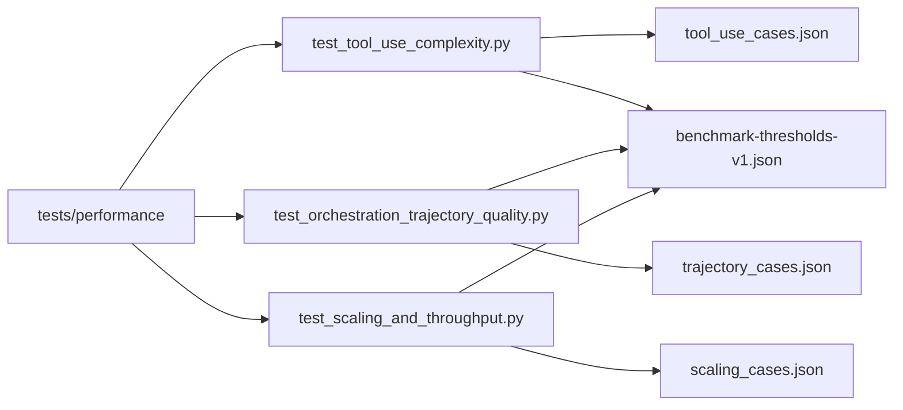
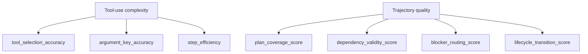
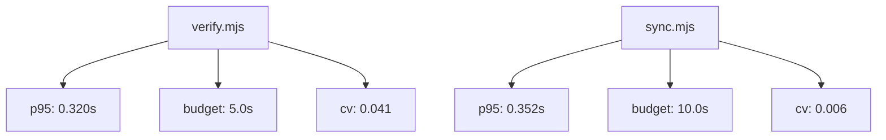

# Performance Benchmarks

This page documents the v2 benchmark suite that validates agent-team quality and
runtime health.

## Scope

The benchmark suite is deterministic, offline, and CI-safe.

- Tool-use quality
- Orchestration trajectory quality
- Runtime scaling and throughput envelope

## Benchmark topology



## Quality metric diagram



## Runtime envelope diagram

Latest local baseline run snapshot:



## Threshold policy

Thresholds are versioned in:

- `tests/_baselines/benchmark-thresholds-v1.json`

Fixtures are versioned in:

- `tests/fixtures/benchmarks/tool_use_cases.json`
- `tests/fixtures/benchmarks/trajectory_cases.json`
- `tests/fixtures/benchmarks/scaling_cases.json`

## Running benchmarks

```bash
# Default CI-equivalent benchmark run
python3 tests/run.py --suite performance -v

# Stress mode for deeper local checks
BENCH_STRESS=1 python3 tests/run.py --suite performance -v
```

## Related pages

- [Architecture](architecture)
- [Contributing Workflow](contributing-workflow)
- [Home](home)
