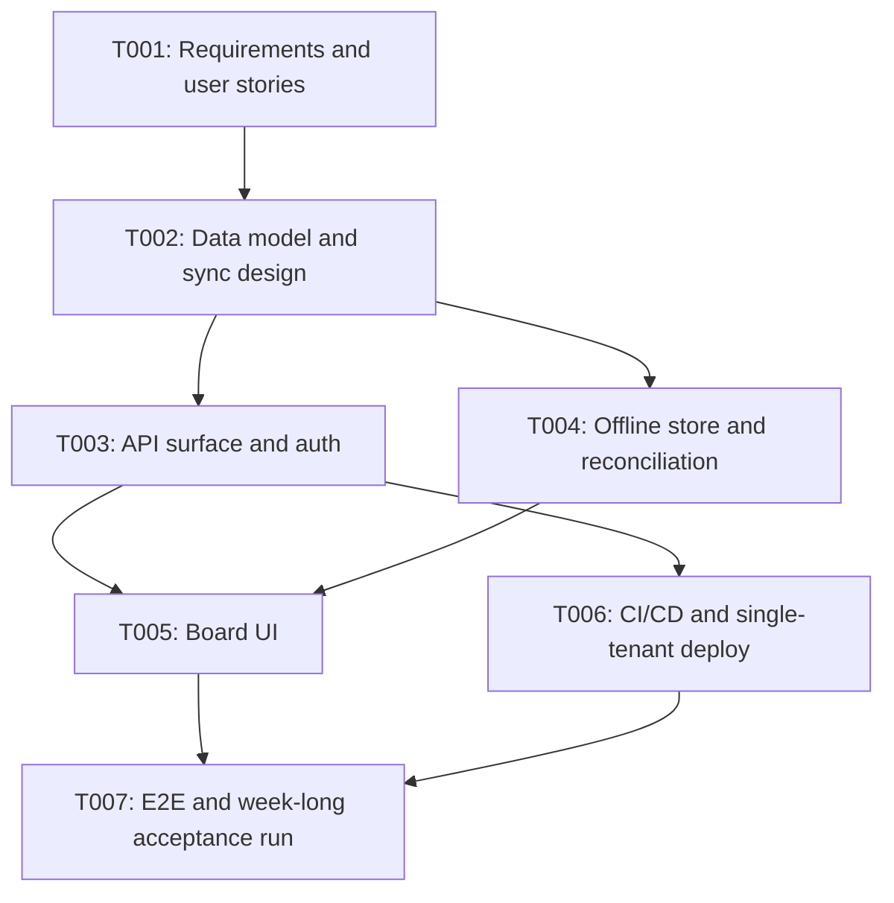

# plan-taskflow — TaskFlow: a shared-team task board with offline-first editing

## Objective

Deliver a self-hosted task board a co-located team of up to 20 people can use from a browser and
keep using while offline, with edits reconciling deterministically on reconnect. Success is a team
completing a full working week on it without a manual conflict resolution.

## Scope

**In scope:** board/list/card CRUD, per-card assignment and due dates, offline-first local store
with last-writer-wins-per-field reconciliation, session auth, a single-tenant deployment.

**Out of scope:** multi-tenancy, billing, mobile-native clients, real-time cursors, integrations with
external trackers, file attachments. These are named to prevent scope drift into them; each is a
follow-up project, not a stretch goal of this one.

## Task DAG (Mermaid)

## Risk assessment

| # | Risk | Likelihood | Impact | Mitigation |
|---|------|-----------|--------|------------|
| 1 | Field-level reconciliation is under-specified and produces surprising merges | Medium | High | T002 delivers a written reconciliation table with worked examples before T004 starts; T007's acceptance run is the gate |
| 2 | Offline store schema migrations strand existing local data | Medium | High | Versioned local schema with a forward-only migration path, exercised in T004's tests |
| 3 | Auth added late forces API rework | Low | Medium | T003 delivers auth with the API surface, not after it |
| 4 | Week-long acceptance run slips and becomes a rubber stamp | Medium | Medium | T007 is scheduled with its own phase and a named owner; a short run is a FAIL, not a partial pass |

## Estimated phases

| Phase | Tasks | Estimate |
|-------|-------|----------|
| 1 — Requirements | T001 | 2 days |
| 2 — Architecture | T002, T003 | 4 days |
| 3 — Implementation | T004, T005, T006 | 8 days |
| 4 — Validation | T007 | 5 days (calendar-bound: the acceptance run is a full working week) |

Four phases, seven tasks, approximately 19 working days.
