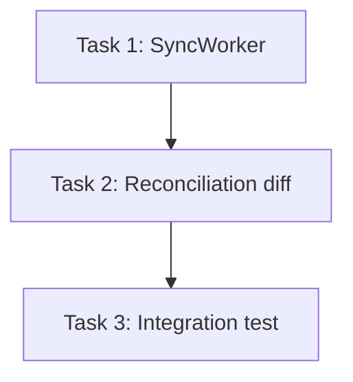

# Plan — Widget Sync

## Goal
Add a background sync job that reconciles local widget state with the remote inventory service.

## Task Decomposition
1. Implement `SyncWorker.run()` polling loop — AC: exits cleanly on SIGTERM, retries transient
   errors with backoff.
2. Add reconciliation diff logic — AC: produces a minimal patch set, no false-positive diffs on
   an already-synced fixture.
3. Add integration test against a fake inventory service — AC: covers add/update/delete cases.

## Dependency Graph

## Resource Assignments
| Task | Agent |
|------|-------|
| 1 | backend-developer |
| 2 | backend-developer |
| 3 | qa-engineer |

## Risk Assessment
| Task | Complexity | Risk | Mitigation |
|------|-----------|------|------------|
| 1 | M | Backoff tuning could mask real outages | Cap retries, alert after N failures |
| 2 | M | Diff false positives on clock skew | Normalize timestamps before comparing |
| 3 | S | Fake service drifts from real API | Pin fake service to a versioned OpenAPI spec |

## Open Questions
- Should sync run on a fixed interval or be event-driven off inventory webhooks?
