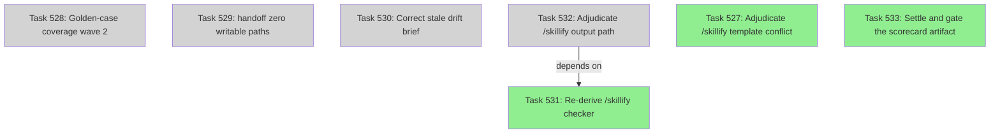

# Sprint status — phase 9 golden-case coverage

## Sprint Metrics

1. **Completed Items**: `T527` (adjudicate the /skillify template conflict, 5 pts), `T531`
   (re-derive the /skillify checker, 3 pts), `T533` (settle and gate the scorecard artifact, 5 pts)
   — 13 points done.
2. **In Progress**: none. All four remaining rows are `pending`; the sprint is between dispatches.
3. **Remaining**: `T528` (P2), `T529` (P2), `T530` (P2), `T532` (P2) — 4 items, 11 points.
4. **Blocked**: none. `T532` declares a dependency on `T531`, which is done, so it is dispatchable.
5. **Velocity**: 13 of 24 committed points complete (54%).
6. **Risks**: `T532` is the only row with an unsatisfied-looking dependency edge and it is in fact
   satisfied; the real risk is that all four remaining rows are P2 and can be deprioritised
   indefinitely without any gate noticing.
7. **Burndown**: on track — 13 points in the first half against a 24-point commitment.

## Task DAG Visualization

No edge is drawn between `T527`, `T531` and `T533`. Their dependencies on each other, if any, are
not reconstructable: `completed-tasks.md` has no `Depends on` column, and no active row names them
together, so the edges are omitted rather than invented.

## Checkpoint Metrics

- Checkpoints written this sprint: 3
- Phase transitions completed: phase 9 wave 1 → wave 2
- Validation gates passed/failed: `tests/run.py` PASS, `validate-tasks.py` PASS,
  `check-maturity.py` PASS (79/0); no gate failed
- Artifact versions produced: `evaluator-hash-known-good-v5.json`,
  `evaluator-hash-known-good-v6.json`, `skillify-contract-resolution-v1.md`,
  `mcp-platform-contract-v2.md`

## Token Spend Summary

- Total tokens used this sprint: ~412k
- Projected remaining budget: ~68k against a 480k five-phase allocation
- Variance from plan: 3% under
- Per-phase breakdown: QA/review 61k, implementation 188k, architecture 92k, planning 71k

## Recommendations

All four remaining rows are P2, which makes them invisible to the ledger-defect scan in
`check-maturity.py` (it filters to P0/P1). If any of them is genuinely gating a promotion, it needs
to be re-prioritised rather than left to drift.
