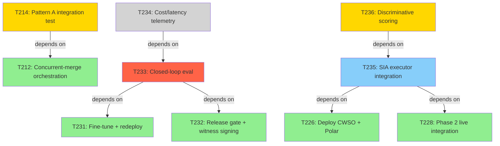

## Team Status

Scope: team-wide (no project/stream filter). Ledger state as of 2026-06-24.

### Active Streams
- T214 in_progress qa-engineer — depends on T212 (done)
- T233 blocked qa-engineer — depends on T231 (done), T232 (done); blocked on evaluator scoring (T233-BLK-002)
- T234 pending devops-engineer — depends on T233 (blocked)
- T235 in_review backend-developer — depends on T226 (done), T228 (done)
- T236 in_progress backend-developer — depends on T235 (in_review)

### Blockers
- T233-BLK-002 HIGH qa-engineer 1d — remediation in flight as T236 (discriminative scoring) — not escalated

### Role Workload
- qa-engineer: 2 streams (medium saturation)
- backend-developer: 2 streams (medium saturation)
- devops-engineer: 1 stream (low saturation)

### Recommended Next Actions
1. Complete review of T235 so T236 can build on a merged executor
2. Land T236 to clear T233-BLK-002
3. Re-run T233's closed-loop eval once T236 merges
4. Hold T234 until T233 produces measurable deltas
5. Close out T214's integration test run

### Checkpoint Delta
- done: [T231, T232]
- in_flight: [T214, T235, T236]
- blocked: [T233]

### Task DAG

### Velocity
- This period: 13 pts (2 tasks)
- Last period: 8 pts (2 tasks)
- Trend: increasing

### Portfolio Dependencies
- None — single-project scope.
